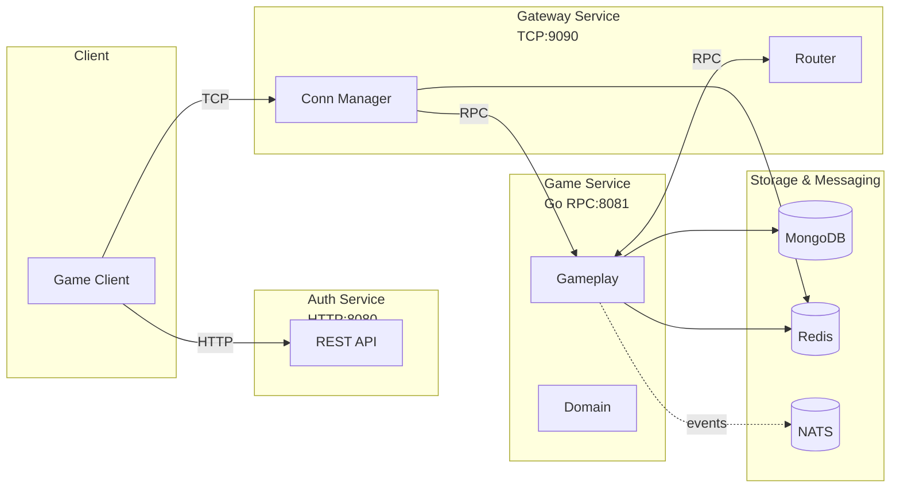
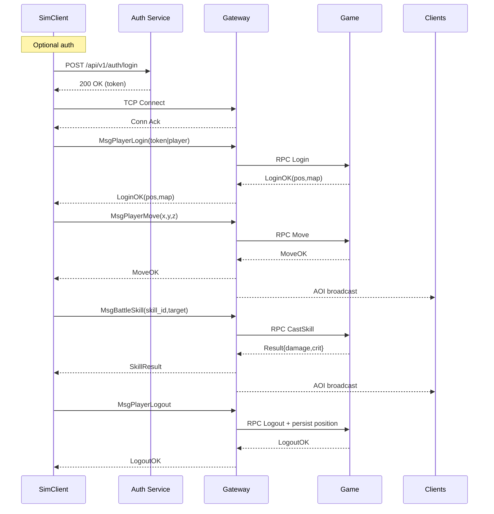
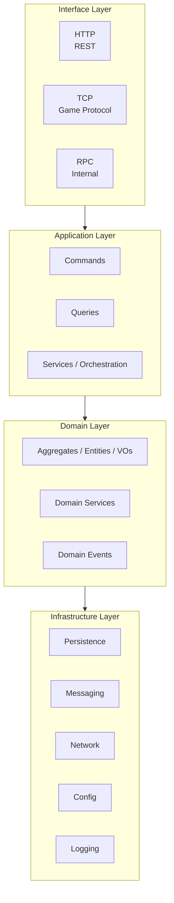

# Greatest Works - Distributed MMO Game Server

A distributed, microservices-based MMO game server built with Go and Domain-Driven Design (DDD). It targets high throughput, horizontal scalability, and clean maintainability.

## Overview

Greatest Works adopts a DDD layered architecture and a multi-node deployment model. The platform splits concerns into dedicated services and uses different transports for each link to balance performance and simplicity.

### Highlights

- Production-grade build: compiles cleanly on Go 1.24+
- DDD architecture with clear boundaries and layering
- Distributed by design: horizontally scalable services
- Microservices: Auth, Gateway, Game, cleanly separated
- Structured logging and optional profiling endpoints
- Container-ready: Docker and Docker Compose

## Core Features

- DDD with clear separation of concerns
- Multi-protocol networking: HTTP + TCP + Go RPC
- Storage strategy: MongoDB (primary) + Redis (cache)
- JWT-based authentication
- Realtime state sync and event broadcasting (AOI)
- Fault-tolerant error handling and observability

## Distributed Architecture

### Services

- Auth Service
  - Protocol: HTTP
  - Port: 8080
  - Responsibilities: authentication, authorization, session

- Gateway Service
  - Protocol: TCP
  - Port: 9090
  - Responsibilities: client connections, protocol framing, routing

- Game Service
  - Protocol: Go RPC
  - Port: 8081
  - Responsibilities: core game logic, aggregates, rules

### Communication



- Client ↔ Auth: HTTP (REST) for login/registration
- Client ↔ Gateway: TCP binary protocol for game messages
- Gateway ↔ Game: Go RPC for internal calls
- Auth ↔ Game: Go RPC for user/session sync

## Simulator Client for E2E and Load Tests

Located in `tools/simclient`. Run as a standalone CLI and drive either a single end-to-end scenario or multi-user load.

### Quickstart

```powershell
go run ./tools/simclient/cmd/simclient -mode integration
```

### E2E Scenario

Built-in end-to-end flows covering login → connect → move → cast skill → logout.

```powershell
# Single E2E run
go run ./tools/simclient/cmd/simclient -mode integration -config tools/simclient/e2e.yaml

# Load (concurrent users)
go run ./tools/simclient/cmd/simclient -mode load -config tools/simclient/e2e_load.yaml

# Toggle auth quickly
go run ./tools/simclient/cmd/simclient -mode integration -config tools/simclient/e2e.yaml -auth
go run ./tools/simclient/cmd/simclient -mode integration -config tools/simclient/e2e.yaml -no-auth
```

For advanced details (framing, JSON payloads, timings, metrics), see `tools/simclient/README_E2E.md`.

#### E2E Sequence (Overview)



## Latest Updates (2025-10)

- Character position persistence: restore on login; save on logout/disconnect
- Combat damage and critical hits (10% chance, 1.5x multiplier); result broadcast via AOI
- New E2E configs: `tools/simclient/e2e.yaml` and `e2e_load.yaml`
- Gateway now requires MongoDB to persist positions (use `docker-compose up -d` locally)

## Quick Start

### Requirements

- Go 1.24+
- MongoDB 4.4+ (5.0+ recommended)
- Redis 6.0+ (7.0+ recommended)
- Docker 20.10+ (optional)

### Install deps

```bash
go mod tidy
```

### Run services

Windows (PowerShell):

```powershell
scripts/start-services.bat
```

Linux/macOS:

```bash
./scripts/start-services.sh
```

Manual run:

```bash
go run cmd/auth-service/main.go
go run cmd/game-service/main.go
go run cmd/gateway-service/main.go
```

> Note: The Gateway service requires a reachable MongoDB instance for position persistence. Consider `docker-compose up -d` to bootstrap dependencies locally.

### Service Endpoints

- Auth: http://localhost:8080
- Gateway: tcp://localhost:9090
- Game: rpc://localhost:8081 (internal only)

## Architecture Diagrams

### DDD Layers



## Profiling (pprof)

Enable via `monitoring.profiling` in config. Default ports: Game 6060, Auth 6061, Gateway 6062. Use `go tool pprof` against `http://<host>:<port>/debug/pprof/`.

## Deployment

```bash
docker-compose up -d
```

## Docs & Contributing

- Issues: https://github.com/phuhao00/greatestworks/issues
- Discussions: https://github.com/phuhao00/greatestworks/discussions
- See CONTRIBUTING.md for guidelines

## License

MIT. See LICENSE for details.

---

If this project helps you, please consider starring the repo. Thanks!
