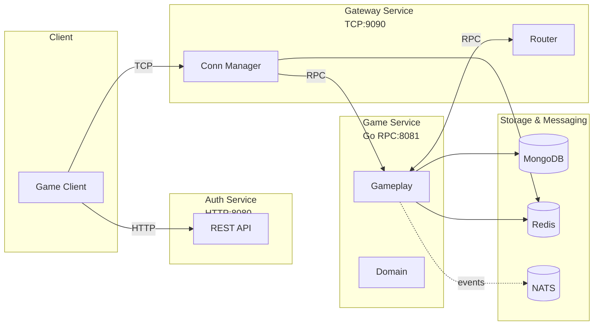
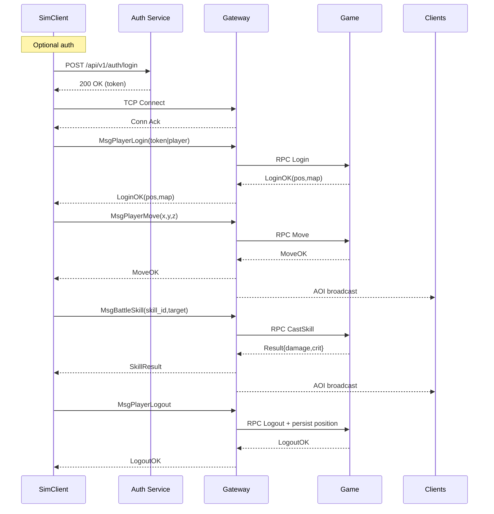
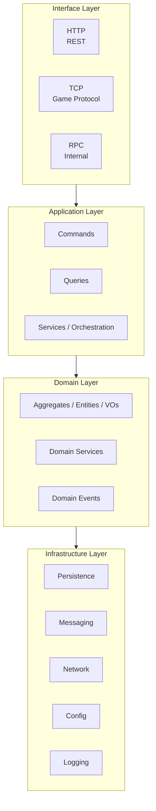

# Greatest Works - Distributed MMO Game Server

A distributed, microservices-based MMO game server built with Go and Domain-Driven Design (DDD). It targets high throughput, horizontal scalability, and clean maintainability.

## Overview

Greatest Works adopts a DDD layered architecture and a multi-node deployment model. The platform splits concerns into dedicated services and uses different transports for each link to balance performance and simplicity.

### Highlights

- Production-grade build: compiles cleanly on Go 1.24+
- DDD architecture with clear boundaries and layering
- Distributed by design: horizontally scalable services
- Microservices: Auth, Gateway, Game, cleanly separated
- Structured logging and optional profiling endpoints
- Container-ready: Docker and Docker Compose

## Core Features

- DDD with clear separation of concerns
- Multi-protocol networking: HTTP + TCP + Go RPC
- Storage strategy: MongoDB (primary) + Redis (cache)
- JWT-based authentication
- Realtime state sync and event broadcasting (AOI)
- Fault-tolerant error handling and observability

## Distributed Architecture

### Services

- Auth Service
  - Protocol: HTTP
  - Port: 8080
  - Responsibilities: authentication, authorization, session

- Gateway Service
  - Protocol: TCP
  - Port: 9090
  - Responsibilities: client connections, protocol framing, routing

- Game Service
  - Protocol: Go RPC
  - Port: 8081
  - Responsibilities: core game logic, aggregates, rules

### Communication



- Client ↔ Auth: HTTP (REST) for login/registration
- Client ↔ Gateway: TCP binary protocol for game messages
- Gateway ↔ Game: Go RPC for internal calls
- Auth ↔ Game: Go RPC for user/session sync

## Simulator Client for E2E and Load Tests

Located in `tools/simclient`. Run as a standalone CLI and drive either a single end-to-end scenario or multi-user load.

### Quickstart

```powershell
go run ./tools/simclient/cmd/simclient -mode integration
```

### E2E Scenario

Built-in end-to-end flows covering login → connect → move → cast skill → logout.

```powershell
# Single E2E run
go run ./tools/simclient/cmd/simclient -mode integration -config tools/simclient/e2e.yaml

# Load (concurrent users)
go run ./tools/simclient/cmd/simclient -mode load -config tools/simclient/e2e_load.yaml

# Toggle auth quickly
go run ./tools/simclient/cmd/simclient -mode integration -config tools/simclient/e2e.yaml -auth
go run ./tools/simclient/cmd/simclient -mode integration -config tools/simclient/e2e.yaml -no-auth
```

For advanced details (framing, JSON payloads, timings, metrics), see `tools/simclient/README_E2E.md`.

#### E2E Sequence (Overview)



## Latest Updates (2025-10)

- Character position persistence: restore on login; save on logout/disconnect
- Combat damage and critical hits (10% chance, 1.5x multiplier); result broadcast via AOI
- New E2E configs: `tools/simclient/e2e.yaml` and `e2e_load.yaml`
- Gateway now requires MongoDB to persist positions (use `docker-compose up -d` locally)

## Quick Start

### Requirements

- Go 1.24+
- MongoDB 4.4+ (5.0+ recommended)
- Redis 6.0+ (7.0+ recommended)
- Docker 20.10+ (optional)

### Install deps

```bash
go mod tidy
```

### Run services

Windows (PowerShell):

```powershell
scripts/start-services.bat
```

Linux/macOS:

```bash
./scripts/start-services.sh
```

Manual run:

```bash
go run cmd/auth-service/main.go
go run cmd/game-service/main.go
go run cmd/gateway-service/main.go
```

> Note: The Gateway service requires a reachable MongoDB instance for position persistence. Consider `docker-compose up -d` to bootstrap dependencies locally.

### Service Endpoints

- Auth: http://localhost:8080
- Gateway: tcp://localhost:9090
- Game: rpc://localhost:8081 (internal only)

## Architecture Diagrams

### DDD Layers



## Profiling (pprof)

Enable via `monitoring.profiling` in config. Default ports: Game 6060, Auth 6061, Gateway 6062. Use `go tool pprof` against `http://<host>:<port>/debug/pprof/`.

## Deployment

### 🐳 Docker Deployment

```bash
# Start complete environment (includes MongoDB, Redis)
docker-compose up -d

# Check service status
docker-compose ps

# View logs
docker-compose logs -f
```

### ☸️ Kubernetes Deployment

The project provides complete local Kubernetes deployment configurations supporting both Docker Desktop and Minikube. All k8s manifests are in the `k8s/local/` directory.

#### 📋 Prerequisites

- **Kubernetes**: Docker Desktop built-in k8s or Minikube 1.28+
- **kubectl**: Version matching your cluster
- **Docker**: 20.10+ (for building images)
- **PowerShell**: 5.1+ (Windows) or Bash (Linux/macOS)

#### 🚀 Quick Deploy (3 Steps)

**Step 1: Build Service Images**

```powershell
# Windows PowerShell
./scripts/build-images.ps1 -Tag dev

# Linux / macOS
./scripts/build-images.sh -t dev
```

Build artifacts:
- `greatestworks-auth:dev` (Auth service)
- `greatestworks-game:dev` (Game service)
- `greatestworks-gateway:dev` (Gateway service)

**Step 2: Load Images into Kubernetes Nodes**

> This step resolves the issue where Docker Desktop k8s cannot directly use local images.

```powershell
# Windows PowerShell
./scripts/load-images-to-k8s.ps1 -Tag dev

# Minikube users alternative
minikube image load greatestworks-auth:dev
minikube image load greatestworks-game:dev
minikube image load greatestworks-gateway:dev
minikube image load mongo:7
minikube image load redis:7
```

**Step 3: Deploy to Cluster**

```powershell
# Create namespace and deploy all services
kubectl apply -f k8s/local/namespace.yaml
kubectl apply -f k8s/local/mongodb.yaml
kubectl apply -f k8s/local/redis.yaml
kubectl apply -f k8s/local/configmap-gateway.yaml
kubectl apply -f k8s/local/auth-service.yaml
kubectl apply -f k8s/local/game-service.yaml
kubectl apply -f k8s/local/gateway-service.yaml

# Wait for Pods to be ready (about 1-2 minutes)
kubectl -n gaming get pods -w
```

Expected output (all Pods `Running` with `READY` as `1/1`):

```
NAME                               READY   STATUS    RESTARTS   AGE
auth-service-xxxxxxxxx-xxxxx       1/1     Running   0          2m
game-service-xxxxxxxxx-xxxxx       1/1     Running   0          2m
gateway-service-xxxxxxxxx-xxxxx    1/1     Running   0          2m
mongodb-xxxxxxxxx-xxxxx            1/1     Running   0          2m
redis-xxxxxxxxx-xxxxx              1/1     Running   0          2m
```

#### 🌐 Accessing Services

After successful deployment, services are exposed via NodePort locally:

| Service | Protocol | Port | Access URL | Purpose |
|---------|----------|------|------------|---------|
| **Auth Service** | HTTP | 30080 | `http://localhost:30080` | User login, registration, JWT auth |
| **Gateway Service** | TCP | 30909 | `localhost:30909` | Game client persistent connection |
| **Game Service** | RPC | 8081 | Internal only | Game logic (not exposed) |
| **MongoDB** | TCP | 27017 | Internal only | Data persistence |
| **Redis** | TCP | 6379 | Internal only | Cache & sessions |

**Verify Service Availability:**

```powershell
# View service endpoints
kubectl -n gaming get svc

# View Pod logs
kubectl -n gaming logs -l app=auth-service --tail=50
kubectl -n gaming logs -l app=gateway-service --tail=50
kubectl -n gaming logs -l app=game-service --tail=50

# Test auth service health (if /health endpoint is implemented)
curl http://localhost:30080/health
```

#### 🔧 Common Operations

**Check Cluster Status:**

```powershell
# View all resources
kubectl -n gaming get all

# View Pod details
kubectl -n gaming describe pod <pod-name>

# Enter container for debugging
kubectl -n gaming exec -it <pod-name> -- sh
```

**Restart Services (after config changes):**

```powershell
# Restart single service
kubectl -n gaming rollout restart deploy/auth-service

# Restart all services
kubectl -n gaming rollout restart deploy --all

# Wait for rollout completion
kubectl -n gaming rollout status deploy/auth-service
```

**Update Images (after code changes):**

```powershell
# 1. Rebuild images
./scripts/build-images.ps1 -Tag dev

# 2. Reload into k8s nodes
./scripts/load-images-to-k8s.ps1 -Tag dev

# 3. Force restart Pods (trigger image reload)
kubectl -n gaming rollout restart deploy --all
```

**Clean Up Environment:**

```powershell
# Delete all resources (keep namespace)
kubectl delete -f k8s/local/gateway-service.yaml
kubectl delete -f k8s/local/game-service.yaml
kubectl delete -f k8s/local/auth-service.yaml
kubectl delete -f k8s/local/configmap-gateway.yaml
kubectl delete -f k8s/local/redis.yaml
kubectl delete -f k8s/local/mongodb.yaml

# Delete namespace (cascading delete all resources)
kubectl delete namespace gaming
```

#### 📦 Push Images to Remote Registry (Optional)

If you need to deploy on multiple machines or in CI/CD environments, push images to Docker Hub or a private registry:

**Method 1: Use Publish Script**

```powershell
# Login to Docker Hub
docker login

# Push images to your repository
./scripts/publish-images.ps1 `
  -Registry docker.io `
  -Namespace YOUR_DOCKERHUB_USERNAME `
  -Tag dev `
  -IncludeInfra  # Optional: also push mongo and redis
```

**Method 2: Use Kustomize Overlay**

The project provides `k8s/local/overlays/registry/` config to automatically replace image paths during deployment:

```powershell
# 1. Edit k8s/local/overlays/registry/kustomization.yaml
#    Replace REPLACE_ME with your registry namespace, e.g.: docker.io/phuhao00

# 2. Deploy with kustomize
kubectl apply -k k8s/local/overlays/registry

# 3. Verify deployment
kubectl -n gaming get pods
```

#### 🐛 Troubleshooting

**Issue 1: Pod Status `ImagePullBackOff` or `ErrImagePull`**

**Cause**: Kubernetes cannot pull images from local Docker.

**Solution**:
- Ensure `./scripts/load-images-to-k8s.ps1` has been executed
- Check Pod's `imagePullPolicy` is `IfNotPresent`
- Verify image is loaded: `kubectl -n gaming describe pod <pod-name> | Select-String -Pattern "Image"`

**Issue 2: Pod Status `CrashLoopBackOff`**

**Cause**: Service fails to start, usually due to config errors or dependencies not ready.

**Solution**:
```powershell
# View crash logs
kubectl -n gaming logs <pod-name> --previous

# Common causes:
# - MongoDB/Redis not ready → Wait for infrastructure Pods to start first
# - Environment variable misconfiguration → Check Deployment env config
# - Port conflict → Check containerPort and Service port mapping
```

**Issue 3: Cannot Access Service via NodePort**

**Cause**: NodePort not properly mapped or firewall blocking.

**Solution**:
```powershell
# Verify Service config
kubectl -n gaming get svc

# Confirm NodePort range (default 30000-32767)
# Check Windows Firewall or Docker Desktop network settings

# Temporary workaround: use port forwarding
kubectl -n gaming port-forward svc/auth-service 8080:8080
kubectl -n gaming port-forward svc/gateway-service 9090:9090
```

**Issue 4: MongoDB/Redis Connection Failed**

**Cause**: Service startup order issue or DNS resolution failure.

**Solution**:
```powershell
# Check if infrastructure services are running
kubectl -n gaming get pods -l app=mongodb
kubectl -n gaming get pods -l app=redis

# Verify service DNS resolution (test in Pod)
kubectl -n gaming exec -it <auth-pod> -- nslookup mongodb
kubectl -n gaming exec -it <auth-pod> -- nslookup redis

# Check service endpoints
kubectl -n gaming get endpoints
```

#### 📊 Monitoring & Logging

**Real-time Log Viewing:**

```powershell
# Follow single service
kubectl -n gaming logs -f deploy/auth-service

# View all service logs (multiple windows)
kubectl -n gaming logs -f -l app=auth-service
kubectl -n gaming logs -f -l app=game-service
kubectl -n gaming logs -f -l app=gateway-service

# View Pod events
kubectl -n gaming get events --sort-by='.lastTimestamp'
```

**Resource Usage:**

```powershell
# View Pod resource consumption
kubectl -n gaming top pods

# View node resources
kubectl top nodes
```

#### 🔐 Production Environment Enhancements

Local deployment uses simplified configs. For production, consider:

**Security:**
- Use Kubernetes Secrets for sensitive data (DB passwords, JWT keys)
- Enable NetworkPolicy to restrict Pod-to-Pod communication
- Configure RBAC access control
- Use TLS for inter-service communication

**High Availability:**
- Increase replicas (`replicas: 3`)
- Configure PodDisruptionBudget
- Use StatefulSet for stateful services (MongoDB)
- Enable HorizontalPodAutoscaler for auto-scaling

**Persistence:**
- Configure PersistentVolumeClaim for MongoDB (avoid emptyDir)
- Regular database backups
- Configure data retention policies

**Example: Production-grade MongoDB Deployment**

```yaml
# Use StatefulSet + PVC (recommended for production)
apiVersion: apps/v1
kind: StatefulSet
metadata:
  name: mongodb
  namespace: gaming
spec:
  serviceName: mongodb
  replicas: 3
  selector:
    matchLabels:
      app: mongodb
  template:
    spec:
      containers:
      - name: mongodb
        image: mongo:7
        volumeMounts:
        - name: mongo-data
          mountPath: /data/db
  volumeClaimTemplates:
  - metadata:
      name: mongo-data
    spec:
      accessModes: ["ReadWriteOnce"]
      resources:
        requests:
          storage: 10Gi
```

#### 🎯 Performance Tuning Tips

**Resource Quota Adjustment:**

Modify resource limits in `k8s/local/*-service.yaml` based on actual load:

```yaml
resources:
  requests:
    cpu: "500m"      # Guaranteed allocation
    memory: "512Mi"
  limits:
    cpu: "2"         # Maximum usage
    memory: "2Gi"
```

**Concurrent Connection Optimization:**

Adjust gateway config in `k8s/local/configmap-gateway.yaml`:

```yaml
server:
  tcp:
    max_connections: 50000  # Adjust based on node capacity
    buffer_size: 8192       # Increase buffer size
```

**Database Connection Pool:**

Optimize connection pool parameters in service configs:

```yaml
database:
  mongodb:
    max_pool_size: 200
    min_pool_size: 50
  redis:
    pool_size: 200
    min_idle_conns: 50
```

#### 📚 Related Documentation

- [Kubernetes Manifest Documentation](k8s/local/README.md) (to be created)
- [Docker Image Build Script](scripts/build-images.ps1)
- [Image Load Script](scripts/load-images-to-k8s.ps1)
- [Kustomize Overlay](k8s/local/overlays/registry/)

---

## Docs & Contributing

- Issues: https://github.com/phuhao00/greatestworks/issues
- Discussions: https://github.com/phuhao00/greatestworks/discussions
- See CONTRIBUTING.md for guidelines

## License

MIT. See LICENSE for details.

---

If this project helps you, please consider starring the repo. Thanks!
