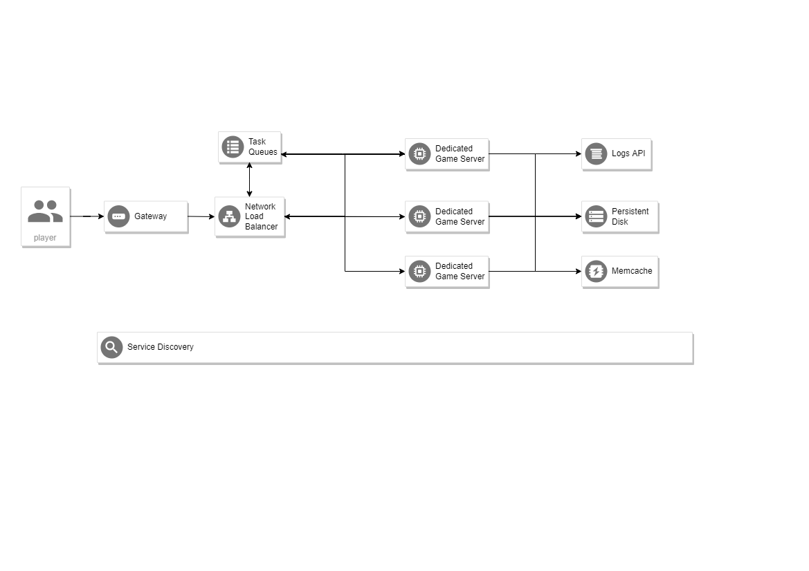

# `greatestworks`

 `greatestworks` is a  framework which include  the back-end logic of game . 

## 初衷 （original intention）

* 1.充分发挥 golang 语言特性 (Give full play to the features of golang language)

* 2.微服务思想,低耦合 (Micro service idea, low coupling)

* 3.面向对象+组合 (Object oriented+combination)

* 4.高性能 (High performance)

### 目录结构说明
* `aop`
  - 面向切面的逻辑
* `business`
  - 业务逻辑
* `gre`
  - 运维，部署，工具等

### `module` 说明

每个模块包含
* `data`
  - 对应的数据存储
* `system`
  - 该模块的管理，例如数据的CRUD，有 `system` 的模块，其成员实例不具备 独立处理协程.
* `owner`
  - 定义从属模块需要实现的些方法
* `handler`
  - 处理从属模块需要的业务逻辑
* `abstract`
  - 模块成员的抽象，接口定义
* `config`
  - 配置,常量的定义等

* `manager`
  - 有 `manager` 的模块，其成员实例独自拥有自己的处理协程,例如Player Manager , Scene Manager

### `Player`

 每个 `Player` 实例 拥有自己的协程

### `Scene`

 每个 `Scene` 实例 拥有自己的协程

### `idea` 

  * 模块之间依赖的属性，借助 `redis` ,`mongo`,`consul`,`nsq`,`rabbitmq`
  * 服务节点之间的依赖，借助 `redis` ,`mongo`,`consul`,`nsq`,`rabbitmq` 
  * 服务节点之间的通讯，通过 `rpc`, `tcp`,`nsq`,`rabbitmq`
  * 客户端与逻辑服务器之间的通讯，通过  `tcp` , `kcp` ,`quic` 
  * 客户段与登录服之间的通讯，通过 `https`

### `deployment`
 
  * docker + k8s
  