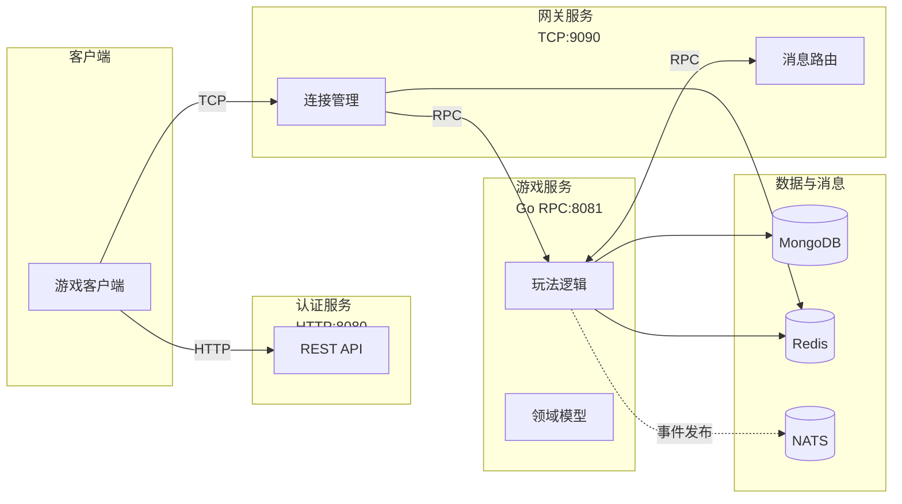
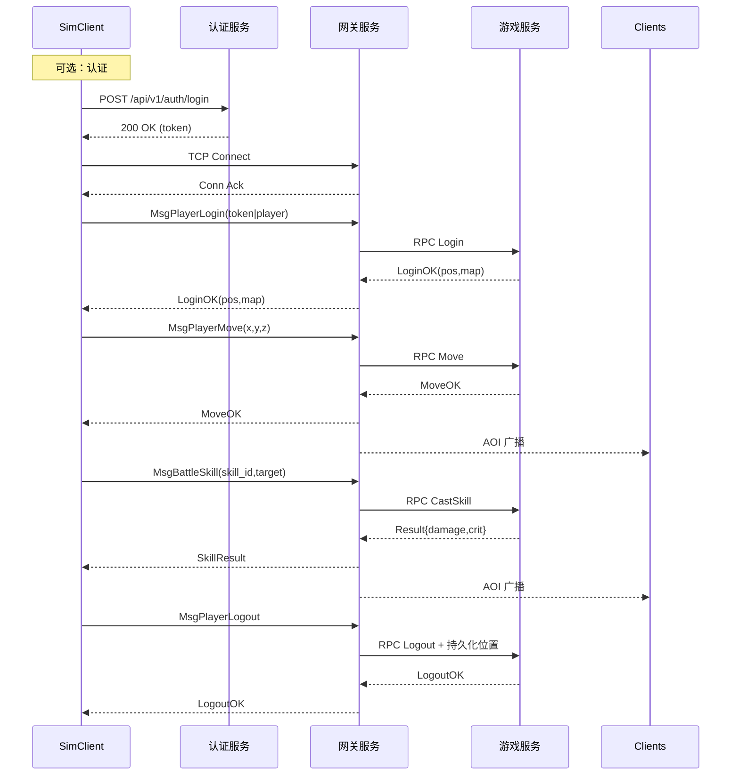
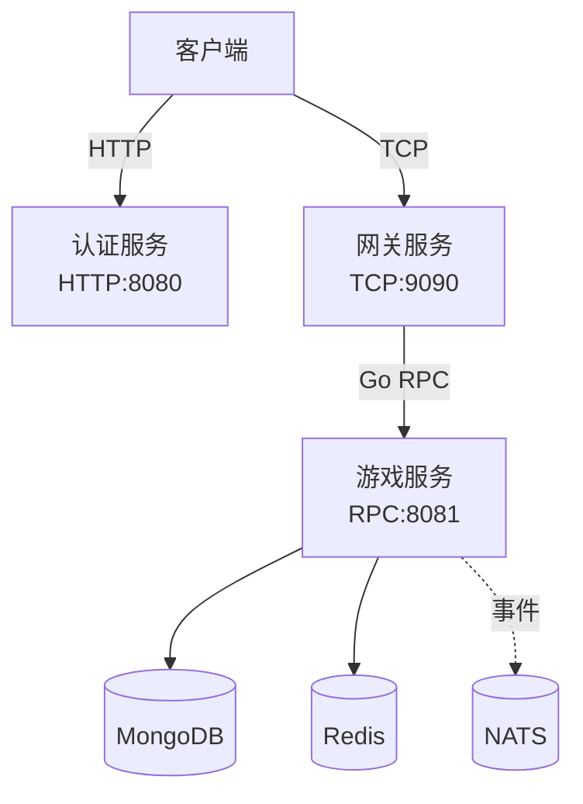
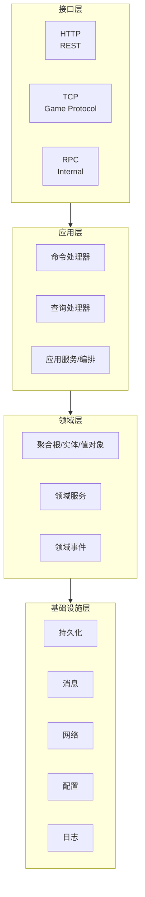

# Greatest Works - 分布式MMO游戏服务器

> English version: see [README.en.md](README.en.md)

基于Go语言和领域驱动设计(DDD)架构开发的分布式大型多人在线游戏服务器，采用现代化微服务设计，支持高并发和分布式部署。

## 🎯 项目概述

这是一个企业级的分布式MMO游戏服务器项目，采用领域驱动设计(Domain-Driven Design)架构模式，提供高性能、可扩展、易维护的游戏服务器解决方案。项目采用分布式多节点架构，支持独立部署和扩展。

### 🏆 项目亮点

- **✅ 编译通过**: 所有代码已修复编译错误，项目可正常构建
- **🏗️ DDD架构**: 完整的领域驱动设计实现
- **🌐 分布式**: 多服务独立部署，支持水平扩展
- **🔧 微服务**: 认证、网关、游戏服务分离
- **📊 监控**: 完整的日志和监控体系
- **🐳 容器化**: Docker和Kubernetes支持

## ✨ 核心特性

- 🏗️ **DDD架构**: 采用领域驱动设计，清晰的架构分层和职责分离
- 🌐 **分布式设计**: 多节点独立部署，支持水平扩展
- 🚀 **高性能网络**: 基于Go原生RPC + TCP + HTTP多协议支持
- 🔧 **微服务架构**: 认证服务、网关服务、游戏服务独立部署
- 💾 **多数据库支持**: MongoDB + Redis 混合存储策略
- 🔐 **安全认证**: JWT认证系统，保障用户数据安全
- 🎮 **完整游戏功能**: 涵盖现代MMO游戏的核心系统
- 📊 **实时同步**: 高频率的游戏状态同步和事件处理
- 🛡️ **容错设计**: 完善的错误处理、监控和恢复机制
- 🐳 **容器化部署**: Docker和Kubernetes支持
- 📚 **完整文档**: 详细的API文档和架构说明

## 🏗️ 分布式架构设计

本项目采用分布式多节点架构，将游戏服务器拆分为三个独立的服务节点：

### 服务节点

#### 🔐 认证服务 (Auth Service)
- **协议**: HTTP
- **端口**: 8080
- **职责**: 用户认证、授权、会话管理
- **功能**: 登录、注册、令牌管理、权限控制

#### 🌐 网关服务 (Gateway Service)  
- **协议**: TCP
- **端口**: 9090
- **职责**: 客户端连接管理、协议转换、负载均衡
- **功能**: 连接管理、消息路由、协议转换

#### 🎮 游戏服务 (Game Service)
- **协议**: Go原生RPC
- **端口**: 8081
- **职责**: 核心游戏逻辑、领域模型、业务规则
- **功能**: 玩家管理、战斗系统、排行榜、社交系统

### 通信协议



- **客户端 ↔ 认证服务**: HTTP (RESTful API) - 用户认证、注册、登录
- **客户端 ↔ 网关服务**: TCP (游戏协议) - 游戏数据交互
- **网关服务 ↔ 游戏服务**: Go原生RPC (内部通信) - 游戏逻辑处理
- **认证服务 ↔ 游戏服务**: Go原生RPC (服务间通信) - 用户状态同步
- **客户端不直接与游戏服务通信**: 所有游戏数据通过网关服务转发

## 🧪 集成测试与压测模拟客户端

项目提供了位于 `tools/simclient` 的模拟客户端，可用于端到端集成测试与压测实验。

### 快速体验

```powershell
go run ./tools/simclient/cmd/simclient -mode integration
```

默认会跳过认证服务并连接网关发送基础心跳与移动报文。若需启用认证或自定义参数，可指定配置文件：

```powershell
go run ./tools/simclient/cmd/simclient -mode integration -config tools/simclient/config.example.yaml
```

### E2E 场景（端到端流程）

已内置完整的 E2E 场景与示例配置，覆盖“认证→连接→登录→移动→施法→登出”的完整链路：

```powershell
# 运行单次端到端场景（集成验证）
go run ./tools/simclient/cmd/simclient -mode integration -config tools/simclient/e2e.yaml

# 运行端到端压测（并发多用户）
go run ./tools/simclient/cmd/simclient -mode load -config tools/simclient/e2e_load.yaml

# 可选：快速开关认证流程
# 强制启用认证
go run ./tools/simclient/cmd/simclient -mode integration -config tools/simclient/e2e.yaml -auth
# 强制跳过认证
go run ./tools/simclient/cmd/simclient -mode integration -config tools/simclient/e2e.yaml -no-auth
```

说明与高级用法请参阅 `tools/simclient/README_E2E.md`，包含：报文头+JSON载荷封装、动作时序、错误排查、指标输出等。

#### E2E 交互时序（概览）



### 压测模式

```powershell
go run ./tools/simclient/cmd/simclient -mode load -config tools/simclient/config.example.yaml -users 200 -concurrency 50
```

压测模式会按配置并发启动虚拟玩家，输出各动作的最小值、平均值、P95 与最大耗时，并记录失败样例。

### 集成测试

在服务运行的情况下，可以开启模拟客户端的冒烟测试：

```powershell
$Env:SIMCLIENT_E2E="1"; go test ./tools/simclient -run TestBasicScenarioSmoke -count=1
```

未设置环境变量时，测试会自动跳过，避免在未部署依赖服务时误报失败。

### 功能级场景（独立功能验证）

模拟客户端现在支持基于功能库的可配置场景，便于对单个系统（如玩家、战斗、宠物等）进行独立验证。通过在配置文件中将 `scenario.type` 设为 `feature`，即可按功能清单驱动消息序列：

```yaml
scenario:
  name: "pet-feature-check"
  type: "feature"          # 可选：basic（默认）或 feature
  features:                 # 复用内置功能库（详见 tools/simclient/feature_library.go）
    - "player.basic"
    - "pet.basic"
  actions:                  # 也可追加自定义动作
    - name: "quest.accept"
      message: "quest.accept"
      expect_response: true
      pause: "2s"
```

常用功能标识包括 `player.login`、`battle.basic`、`pet.summon`、`building.status` 等。每个功能会自动映射到对应的网关消息并记录响应时间。若仅配置 `scenario.type` 而省略 `features`，程序会尝试匹配内置功能；也可以完全使用 `actions` 字段自定义报文序列，支持设置 `flags`、`repeat`、`pause` 等参数，实现更精细的验证脚本。

## 📁 项目结构

```
greatestworks/
├── cmd/                        # 应用程序入口
│   ├── auth-service/           # 认证服务 (HTTP:8080)
│   │   └── main.go
│   ├── gateway-service/        # 网关服务 (TCP:9090)
│   │   └── main.go
│   └── game-service/           # 游戏服务 (RPC:8081)
│       └── main.go
├── configs/                    # 配置文件
│   ├── auth-service.yaml       # 认证服务配置
│   ├── gateway-service.yaml    # 网关服务配置
│   ├── game-service.yaml       # 游戏服务配置
│   ├── docker.yaml            # Docker环境配置
│   └── config.*.yaml          # 环境配置模板
├── docs/                       # 项目文档
│   └── diagrams/              # 架构图表
│       ├── module.drawio      # 模块关系图
│       ├── svr.frame.drawio   # 服务器架构图
│       └── uml.drawio         # UML类图
├── internal/                   # 内部模块 (DDD架构)
│   ├── application/           # 应用层 (CQRS + 服务编排)
│   │   ├── commands/          # 命令处理器
│   │   ├── handlers/          # 命令/查询总线实现
│   │   ├── interfaces/        # 应用层接口契约
│   │   ├── queries/           # 查询处理器
│   │   └── services/          # 应用服务与 service_registry
│   ├── domain/                # 领域层
│   │   ├── player/           # 玩家领域
│   │   │   ├── beginner/     # 新手引导
│   │   │   ├── hangup/       # 挂机系统
│   │   │   ├── honor/        # 荣誉系统
│   │   │   ├── player.go     # 玩家聚合根
│   │   │   ├── service.go    # 领域服务
│   │   │   └── repository.go # 仓储接口
│   │   ├── battle/           # 战斗领域
│   │   ├── social/           # 社交领域 (31个文件)
│   │   ├── building/         # 建筑领域
│   │   ├── pet/              # 宠物领域
│   │   ├── ranking/          # 排行榜领域
│   │   ├── minigame/         # 小游戏领域
│   │   ├── npc/              # NPC领域
│   │   ├── quest/            # 任务领域
│   │   ├── scene/            # 场景领域 (24个文件)
│   │   ├── skill/            # 技能领域
│   │   ├── inventory/        # 背包领域
│   │   │   ├── dressup/      # 装扮系统
│   │   │   └── synthesis/    # 合成系统
│   │   └── events/           # 领域事件
│   ├── infrastructure/        # 基础设施层
│   │   ├── persistence/      # 数据持久化 (10个文件)
│   │   │   ├── base_repository.go    # 基础仓储
│   │   │   ├── player_repository.go  # 玩家仓储
│   │   │   ├── battle_repository.go  # 战斗仓储
│   │   │   ├── hangup_repository.go # 挂机仓储
│   │   │   ├── weather_repository.go # 天气仓储
│   │   │   ├── plant_repository.go   # 植物仓储
│   │   │   └── npc_repository.go     # NPC仓储
│   │   ├── cache/            # 缓存服务
│   │   ├── messaging/        # 消息服务 (5个文件)
│   │   │   ├── nats_publisher.go    # NATS发布者
│   │   │   ├── nats_subscriber.go   # NATS订阅者
│   │   │   ├── event_dispatcher.go  # 事件分发器
│   │   │   └── worker_pool.go       # 工作池
│   │   ├── network/          # 网络服务
│   │   ├── config/           # 配置管理 (7个文件)
│   │   ├── logging/          # 日志服务
│   │   ├── auth/            # 认证服务
│   │   ├── container/       # 依赖注入容器
│   │   └── monitoring/      # 监控服务
│   ├── interfaces/            # 接口层
│   │   ├── http/             # HTTP接口 (13个文件)
│   │   │   ├── auth/         # 认证接口
│   │   │   ├── gm/           # GM管理接口
│   │   │   └── server.go     # HTTP服务器
│   │   ├── tcp/              # TCP接口 (14个文件)
│   │   │   ├── handlers/     # TCP处理器
│   │   │   ├── connection/   # 连接管理
│   │   │   └── protocol/     # 协议定义
│   │   └── rpc/              # RPC接口 (4个文件)
│   ├── events/               # 事件系统
│   │   ├── eventbus.go       # 事件总线
│   │   ├── middleware.go      # 事件中间件
│   │   └── worker.go         # 事件工作器
│   ├── errors/               # 错误处理
│   │   └── domain_errors.go # 领域错误
│   ├── proto/                # 协议定义
│   │   ├── battle/           # 战斗协议
│   │   ├── player/           # 玩家协议
│   │   └── common/           # 通用协议
│   └── readme.md             # 内部模块说明
├── proto/                     # Protocol Buffers定义
│   ├── battle.proto          # 战斗协议
│   ├── player.proto          # 玩家协议
│   ├── pet.proto             # 宠物协议
│   └── common.proto          # 通用协议
├── scripts/                   # 开发脚本
│   ├── start-services.bat    # Windows启动脚本
│   ├── start-services.sh     # Linux/Mac启动脚本
│   ├── build.sh              # 构建脚本
│   ├── deploy.sh             # 部署脚本
│   ├── generate_proto.sh     # 协议生成脚本
│   └── setup-dev.sh          # 开发环境设置
├── docker-compose.yml         # Docker编排
├── Dockerfile                 # Docker镜像
├── Makefile                   # 构建工具
├── go.mod                     # Go模块定义
├── go.work                    # Go工作空间
└── README.md                  # 项目说明
```

## 🛠️ 技术栈

### 核心技术
- **语言**: Go 1.24+
- **架构模式**: 领域驱动设计 (DDD) + 分布式架构
- **网络协议**: HTTP + TCP + Go原生RPC
- **数据库**: MongoDB (主数据库) + Redis (缓存)
- **消息队列**: NATS (可选)
- **认证**: JWT + 自定义认证
- **服务发现**: 支持Consul、Etcd等

### 开发工具
- **构建工具**: Make + Go Modules
- **容器化**: Docker + Docker Compose
- **编排**: Kubernetes
- **代码质量**: golangci-lint + 自定义规范
- **文档**: Markdown + 架构图

### 监控与运维
- **日志**: 结构化日志 + 分级输出
- **监控**: 自定义指标收集（Prometheus 已移除，保留配置项仅为兼容）
- **性能剖析**: 内置 `pprof` HTTP 端点，可按服务独立开启/关闭
- **健康检查**: HTTP健康检查接口
- **配置管理**: YAML配置 + 环境变量

#### 🔍 性能剖析 (pprof)
- 通过 `monitoring.profiling` 配置块启用，默认 `host=0.0.0.0`，启用时若未指定端口则为 `6060`。
- 示例配置：

  ```yaml
  monitoring:
    profiling:
      enabled: true
      host: "0.0.0.0"
      port: 6061
  ```

- 默认示例端口：游戏服务 `6060`、认证服务 `6061`、网关服务 `6062`（可按需调整）。
- 访问方式：`http://<host>:<port>/debug/pprof/`（支持 `profile`, `heap`, `goroutine` 等子路径）。
- 安全建议：仅在受信任网络内开放或通过防火墙/反向代理限制访问；生产环境建议结合 mTLS 或内网隧道。
- Go 原生工具链支持直接采样，例如：

  ```bash
  go tool pprof http://localhost:6060/debug/pprof/profile?seconds=30
  ```

- 常用子路径一览：

  | 路径 | 数据类型 | 典型用途 |
  | --- | --- | --- |
  | `/debug/pprof/profile` | CPU 采样 (默认 30s) | 分析热点函数、CPU 使用率 |
  | `/debug/pprof/heap` | 堆内存快照 | 排查内存占用与泄漏 |
  | `/debug/pprof/goroutine` | Goroutine 堆栈 | 定位死锁、阻塞、协程泄漏 |
  | `/debug/pprof/block` | 阻塞 / 互斥等待 | 查看锁竞争、IO 阻塞（含网络等待） |
  | `/debug/pprof/mutex` | 互斥锁争用 | 识别锁热点 |
  | `/debug/pprof/threadcreate` | 线程创建 | 观察系统线程增量 |
  | `/debug/pprof/trace` | 全局执行轨迹 | 捕获调度、GC、网络事件，生成 `.trace` 文件 |

- 采集跟踪 (含网络事件) 示例：

  ```bash
  go tool trace -http=:0 http://localhost:6060/debug/pprof/trace?seconds=5
  ```

  打开浏览器后可查看网络/系统调用阻塞、协程调度等细节。

#### 🧪 Profiling 快速入门

1. **启用配置**：在目标服务的配置文件中确保 `monitoring.profiling.enabled: true`，并确认端口未被占用。
2. **启动服务**：通过 `make run-<service>`、`docker-compose up` 或自定义脚本启动对应进程。
3. **采集快照**：使用以下命令保存原始数据以便离线分析：

  ```bash
  # CPU 采样 60 秒后保存为 cpu.prof
  curl -o cpu.prof "http://localhost:6060/debug/pprof/profile?seconds=60"

  # 堆内存快照
  curl -o heap.prof "http://localhost:6060/debug/pprof/heap"

  # Goroutine 栈信息
  curl -o goroutine.txt "http://localhost:6060/debug/pprof/goroutine?debug=1"
  ```

4. **可视化分析**：

  ```bash
  # CLI 分析热点函数
  go tool pprof cpu.prof

  # 启动 Web UI（会自动打开浏览器）
  go tool pprof -http=:0 heap.prof
  ```

5. **高级跟踪**：通过 `go tool trace` 加载第 3 步生成的 `.trace` 文件，可在浏览器中查看网络/系统调用、协程调度和 GC 时间线。

> 端口速查：游戏服务 `6060`、认证服务 `6061`、网关服务 `6062`，可根据部署环境在配置文件中调整。


## 🎉 最新更新 (2025-10)

### ✅ 核心改进

- **应用层内聚**: 将原 `application/*` 目录整体迁移至 `internal/application`，统一导入路径并引入集中式 `service_registry`。
- **接口适配**: 同步更新 HTTP/TCP/RPC 适配层的依赖路径，保持命令与查询总线的运行一致性。
- **构建可靠性**: 全量执行 `go fmt ./...` 与 `go test ./...`，确保代码风格统一且测试通过。

### ✨ 新增功能

- 角色位置持久化：登录自动恢复上次地图与坐标，登出/断线即时保存。
- 战斗伤害计算与结果广播：实现基础伤害与暴击（10% 概率，1.5x 倍率），通过 AOI 将结果广播给可见实体。
- 模拟客户端 E2E 场景：新增 `tools/simclient/e2e.yaml` 与 `tools/simclient/e2e_load.yaml`，支持端到端验证与并发压测。
- 依赖提醒：网关服务现需连接 MongoDB 才能完成位置持久化（本地可通过 `docker-compose up -d` 一键拉起依赖）。

### 🧹 技术债务清理

- 归档旧有的应用层入口说明，将文档与现有目录结构保持一致。
- 补充最新的启动脚本说明，方便在 Windows / Linux 环境快速拉起服务。
- 梳理文档链接与示例配置，移除失效路径。

## 🚀 快速开始

### 📋 环境要求

- **Go**: 1.24 或更高版本
- **MongoDB**: 4.4+ (推荐 5.0+)
- **Redis**: 6.0+ (推荐 7.0+)
- **Docker**: 20.10+ (可选，用于容器化部署)

### 📦 安装依赖

```bash
# 克隆项目
git clone https://github.com/phuhao00/greatestworks.git
cd greatestworks

# 安装Go依赖
go mod tidy
```

### ⚙️ 配置文件

项目使用独立的配置文件，每个服务都有自己的配置：

**Windows (PowerShell):**
```powershell
Copy-Item configs/auth-service.yaml configs/auth-service-dev.yaml
Copy-Item configs/gateway-service.yaml configs/gateway-service-dev.yaml
Copy-Item configs/game-service.yaml configs/game-service-dev.yaml
```

**Linux / macOS:**
```bash
cp configs/auth-service.yaml configs/auth-service-dev.yaml
cp configs/gateway-service.yaml configs/gateway-service-dev.yaml
cp configs/game-service.yaml configs/game-service-dev.yaml
```

### 🎮 启动服务

#### 方式一：使用启动脚本（推荐）

**Windows:**
```powershell
scripts/start-services.bat
```

**Linux/Mac:**
```bash
./scripts/start-services.sh
```

#### 方式二：手动启动

```bash
# 启动认证服务
go run cmd/auth-service/main.go

# 启动游戏服务（新终端）
go run cmd/game-service/main.go

# 启动网关服务（新终端）
go run cmd/gateway-service/main.go
```

> 提示：网关服务需要可用的 MongoDB 实例用于玩家位置持久化。若未手动部署数据库，建议先执行 `docker-compose up -d` 启动依赖环境。

#### 方式三：Docker启动

```bash
# 启动完整环境
docker-compose up -d

# 查看服务状态
docker-compose ps
```

### 🔧 服务地址

启动后，各服务将在以下地址运行：

- **认证服务**: http://localhost:8080 (客户端可访问)
- **网关服务**: tcp://localhost:9090 (客户端可访问)
- **游戏服务**: rpc://localhost:8081 (仅内部服务访问，客户端不可直接访问)

### 📡 客户端访问说明

- **客户端 → 认证服务**: 直接HTTP访问，用于用户认证
- **客户端 → 网关服务**: 直接TCP连接，用于游戏数据交互
- **客户端 → 游戏服务**: ❌ 不直接访问，所有游戏逻辑通过网关服务转发

## 🏛️ 技术架构图

### 🎯 整体架构


### 🏗️ DDD分层架构


## 🏛️ DDD领域架构

### 核心领域 (Core Domains)

#### 🎮 玩家领域 (Player Domain)
- **职责**: 玩家基础信息、等级经验、属性管理
- **核心实体**: Player, PlayerStats, PlayerProfile
- **主要功能**: 玩家创建、升级、属性计算、状态管理

#### ⚔️ 战斗领域 (Battle Domain)
- **职责**: 战斗逻辑、技能系统、伤害计算
- **核心实体**: Battle, Skill, Damage, BattleResult
- **主要功能**: PvP/PvE战斗、技能释放、战斗结算

#### 🏠 社交领域 (Social Domain)
- **职责**: 聊天、好友、家族、队伍系统
- **核心实体**: Chat, Friend, Guild, Team, Mail
- **主要功能**: 社交互动、组队协作、消息通信

#### 🏗️ 建筑领域 (Building Domain)
- **职责**: 建筑系统、家园管理、建筑升级
- **核心实体**: Building, BuildingTemplate, BuildingUpgrade
- **主要功能**: 建筑建造、升级、功能管理

#### 🐾 宠物领域 (Pet Domain)
- **职责**: 宠物系统、宠物培养、宠物战斗
- **核心实体**: Pet, PetTemplate, PetSkill
- **主要功能**: 宠物获取、培养、进化、战斗辅助

#### 🏆 排行榜领域 (Ranking Domain)
- **职责**: 各类排行榜、积分统计、奖励发放
- **核心实体**: Ranking, RankingEntry, RankingReward
- **主要功能**: 排名计算、榜单更新、奖励分发

#### 🎯 小游戏领域 (Minigame Domain)
- **职责**: 各种小游戏、活动玩法、特殊奖励
- **核心实体**: Minigame, MinigameSession, MinigameReward
- **主要功能**: 小游戏逻辑、积分计算、奖励发放

## 🌐 网络协议设计

### 多协议支持
- **HTTP**: 认证服务，RESTful API
- **TCP**: 网关服务，游戏客户端连接
- **RPC**: 服务间通信，Go原生RPC

### TCP协议格式
```
+--------+--------+--------+----------+
| Magic  | Length | Type   | Data     |
| 2bytes | 4bytes | 2bytes | Variable |
+--------+--------+--------+----------+
```

### 消息分类
- **0x1xxx**: 系统消息 (登录、心跳、错误)
- **0x2xxx**: 玩家消息 (属性、状态、升级)
- **0x3xxx**: 社交消息 (聊天、好友、邮件)
- **0x4xxx**: 战斗消息 (技能、伤害、结果)
- **0x5xxx**: 建筑消息 (建造、升级、管理)
- **0x6xxx**: 宠物消息 (获取、培养、战斗)
- **0x7xxx**: 排行榜消息 (查询、更新、奖励)
- **0x8xxx**: 小游戏消息 (开始、操作、结算)
- **0x9xxx**: 管理消息 (GM命令、系统公告)

## 🗄️ 数据存储设计

### MongoDB 集合设计

#### 核心业务集合
- **players**: 玩家基础信息和状态
- **player_stats**: 玩家统计数据和属性
- **battles**: 战斗记录和结果
- **guilds**: 公会信息和成员关系
- **buildings**: 建筑数据和状态
- **pets**: 宠物信息和属性
- **rankings**: 排行榜数据和历史
- **minigames**: 小游戏记录和积分

### Redis 缓存策略

#### 热点数据缓存
- **在线玩家**: `online:players:{server_id}`
- **玩家会话**: `session:{player_id}`
- **排行榜**: `ranking:{type}:{period}`
- **公会信息**: `guild:{guild_id}`

#### 临时数据缓存
- **战斗状态**: `battle:{battle_id}`
- **队伍信息**: `team:{team_id}`
- **聊天频道**: `chat:{channel_id}`
- **活动状态**: `event:{event_id}`

## 👨‍💻 开发指南

### 🏗️ DDD开发模式

#### 添加新领域
1. 在 `internal/domain/` 下创建领域目录
2. 定义领域实体、值对象和聚合根
3. 实现领域服务和仓储接口
4. 创建对应的应用服务
5. 实现基础设施层的具体实现
6. 添加接口层的处理器

#### 领域开发规范
```go
// 领域实体示例
type Player struct {
    id       PlayerID
    name     string
    level    int
    exp      int64
    stats    PlayerStats
    // 领域行为
}

func (p *Player) LevelUp() error {
    // 领域逻辑实现
}
```

### 🔧 开发工具使用

#### Make命令
```bash
make setup      # 初始化开发环境
make dev        # 启动开发服务器
make build      # 构建生产版本
make test       # 运行测试
make lint       # 代码质量检查
make clean      # 清理构建产物
make docs       # 生成文档
```

### 📊 性能优化策略

#### 数据库优化
- **连接池管理**: 合理配置MongoDB和Redis连接池
- **索引优化**: 为查询频繁的字段创建合适索引
- **分片策略**: 大数据量集合采用分片存储
- **读写分离**: 读操作使用从库，写操作使用主库

#### 缓存策略
- **多级缓存**: 内存缓存 + Redis缓存 + 数据库
- **缓存预热**: 服务启动时预加载热点数据
- **缓存更新**: 采用Cache-Aside模式更新缓存
- **缓存穿透**: 使用布隆过滤器防止缓存穿透

#### 网络优化
- **连接复用**: TCP连接池和HTTP Keep-Alive
- **消息批处理**: 批量处理非实时消息
- **压缩传输**: 大数据包启用压缩
- **协议优化**: 使用二进制协议减少传输开销

## 🚀 部署指南

### 🐳 Docker部署

#### Docker Compose部署
```bash
# 启动完整环境（包含MongoDB、Redis）
docker-compose up -d

# 查看服务状态
docker-compose ps

# 查看日志
docker-compose logs -f
```

#### 单容器部署
```bash
# 构建镜像
docker build -t greatestworks .

# 运行认证服务
docker run -d --name auth-service -p 8080:8080 greatestworks auth-service

# 运行游戏服务
docker run -d --name game-service -p 8081:8081 greatestworks game-service

# 运行网关服务
docker run -d --name gateway-service -p 9090:9090 greatestworks gateway-service
```

### ☸️ Kubernetes部署

项目提供了完整的 Kubernetes 本地部署方案，支持 Docker Desktop 和 Minikube。所有 k8s 配置文件位于 `k8s/local/` 目录。

#### 📋 前置要求

- **Kubernetes**: Docker Desktop 内置 k8s 或 Minikube 1.28+
- **kubectl**: 与集群版本匹配
- **Docker**: 20.10+ (用于构建镜像)
- **PowerShell**: 5.1+ (Windows) 或 Bash (Linux/macOS)

#### 🚀 快速部署（三步启动）

**步骤 1: 构建服务镜像**

```powershell
# Windows PowerShell
./scripts/build-images.ps1 -Tag dev

# Linux / macOS
./scripts/build-images.sh -t dev
```

构建产物:
- `greatestworks-auth:dev` (认证服务)
- `greatestworks-game:dev` (游戏服务)
- `greatestworks-gateway:dev` (网关服务)

**步骤 2: 加载镜像到 Kubernetes 节点**

> 此步骤解决 Docker Desktop k8s 无法直接使用本地镜像的问题。

```powershell
# Windows PowerShell
./scripts/load-images-to-k8s.ps1 -Tag dev

# Minikube 用户替代方案
minikube image load greatestworks-auth:dev
minikube image load greatestworks-game:dev
minikube image load greatestworks-gateway:dev
minikube image load mongo:7
minikube image load redis:7
```

**步骤 3: 部署到集群**

```powershell
# 创建命名空间和部署所有服务
kubectl apply -f k8s/local/namespace.yaml
kubectl apply -f k8s/local/mongodb.yaml
kubectl apply -f k8s/local/redis.yaml
kubectl apply -f k8s/local/configmap-gateway.yaml
kubectl apply -f k8s/local/auth-service.yaml
kubectl apply -f k8s/local/game-service.yaml
kubectl apply -f k8s/local/gateway-service.yaml

# 等待 Pod 就绪（约 1-2 分钟）
kubectl -n gaming get pods -w
```

预期输出（所有 Pod 状态为 `Running` 且 `READY` 为 `1/1`）:

```
NAME                               READY   STATUS    RESTARTS   AGE
auth-service-xxxxxxxxx-xxxxx       1/1     Running   0          2m
game-service-xxxxxxxxx-xxxxx       1/1     Running   0          2m
gateway-service-xxxxxxxxx-xxxxx    1/1     Running   0          2m
mongodb-xxxxxxxxx-xxxxx            1/1     Running   0          2m
redis-xxxxxxxxx-xxxxx              1/1     Running   0          2m
```

#### 🌐 访问服务

部署成功后，服务通过 NodePort 暴露在本地：

| 服务 | 协议 | 端口 | 访问地址 | 用途 |
|-----|------|------|---------|------|
| **认证服务** | HTTP | 30080 | `http://localhost:30080` | 用户登录、注册、JWT 验证 |
| **网关服务** | TCP | 30909 | `localhost:30909` | 游戏客户端长连接入口 |
| **游戏服务** | RPC | 8081 | 仅集群内部 | 游戏逻辑处理（不对外暴露） |
| **MongoDB** | TCP | 27017 | 仅集群内部 | 数据持久化 |
| **Redis** | TCP | 6379 | 仅集群内部 | 缓存与会话 |

**验证服务可用性:**

```powershell
# 查看服务端点
kubectl -n gaming get svc

# 查看 Pod 日志
kubectl -n gaming logs -l app=auth-service --tail=50
kubectl -n gaming logs -l app=gateway-service --tail=50
kubectl -n gaming logs -l app=game-service --tail=50

# 测试认证服务健康检查（如果实现了 /health 端点）
curl http://localhost:30080/health
```

#### 🔧 常见操作

**查看集群状态:**

```powershell
# 查看所有资源
kubectl -n gaming get all

# 查看 Pod 详情
kubectl -n gaming describe pod <pod-name>

# 进入容器调试
kubectl -n gaming exec -it <pod-name> -- sh
```

**重启服务（应用配置更改后）:**

```powershell
# 重启单个服务
kubectl -n gaming rollout restart deploy/auth-service

# 重启所有服务
kubectl -n gaming rollout restart deploy --all

# 等待滚动更新完成
kubectl -n gaming rollout status deploy/auth-service
```

**更新镜像（代码变更后）:**

```powershell
# 1. 重新构建镜像
./scripts/build-images.ps1 -Tag dev

# 2. 重新加载到 k8s 节点
./scripts/load-images-to-k8s.ps1 -Tag dev

# 3. 强制重启 Pod（触发镜像重新拉取）
kubectl -n gaming rollout restart deploy --all
```

**清理环境:**

```powershell
# 删除所有资源（保留命名空间）
kubectl delete -f k8s/local/gateway-service.yaml
kubectl delete -f k8s/local/game-service.yaml
kubectl delete -f k8s/local/auth-service.yaml
kubectl delete -f k8s/local/configmap-gateway.yaml
kubectl delete -f k8s/local/redis.yaml
kubectl delete -f k8s/local/mongodb.yaml

# 删除命名空间（会级联删除所有资源）
kubectl delete namespace gaming
```

#### 📦 推送镜像到远程仓库（可选）

如果需要在多台机器或 CI/CD 环境中部署，可以将镜像推送到 Docker Hub 或私有仓库：

**方式 1: 使用发布脚本**

```powershell
# 登录 Docker Hub
docker login

# 推送镜像到你的仓库
./scripts/publish-images.ps1 `
  -Registry docker.io `
  -Namespace YOUR_DOCKERHUB_USERNAME `
  -Tag dev `
  -IncludeInfra  # 可选：同时推送 mongo 和 redis
```

**方式 2: 使用 Kustomize 覆盖层**

项目提供了 `k8s/local/overlays/registry/` 配置，可以在部署时自动替换镜像路径：

```powershell
# 1. 编辑 k8s/local/overlays/registry/kustomization.yaml
#    将 REPLACE_ME 替换为你的仓库命名空间，例如：docker.io/phuhao00

# 2. 使用 kustomize 部署
kubectl apply -k k8s/local/overlays/registry

# 3. 验证部署
kubectl -n gaming get pods
```

#### 🐛 故障排查

**问题 1: Pod 状态为 `ImagePullBackOff` 或 `ErrImagePull`**

**原因**: Kubernetes 无法从本地 Docker 拉取镜像。

**解决方案**:
- 确保已执行 `./scripts/load-images-to-k8s.ps1`
- 检查 Pod 的 `imagePullPolicy` 是否为 `IfNotPresent`
- 验证镜像已加载: `kubectl -n gaming describe pod <pod-name> | Select-String -Pattern "Image"`

**问题 2: Pod 状态为 `CrashLoopBackOff`**

**原因**: 服务启动失败，通常是配置错误或依赖未就绪。

**解决方案**:
```powershell
# 查看崩溃日志
kubectl -n gaming logs <pod-name> --previous

# 常见原因：
# - MongoDB/Redis 未就绪 → 等待基础设施 Pod 先启动
# - 环境变量配置错误 → 检查 Deployment 的 env 配置
# - 端口冲突 → 检查 containerPort 和 Service port 映射
```

**问题 3: 无法通过 NodePort 访问服务**

**原因**: NodePort 未正确映射或防火墙阻止。

**解决方案**:
```powershell
# 验证 Service 配置
kubectl -n gaming get svc

# 确认 NodePort 范围（默认 30000-32767）
# 检查 Windows 防火墙或 Docker Desktop 网络设置

# 临时替代方案：使用端口转发
kubectl -n gaming port-forward svc/auth-service 8080:8080
kubectl -n gaming port-forward svc/gateway-service 9090:9090
```

**问题 4: MongoDB/Redis 连接失败**

**原因**: 服务启动顺序问题或 DNS 解析失败。

**解决方案**:
```powershell
# 检查基础设施服务是否运行
kubectl -n gaming get pods -l app=mongodb
kubectl -n gaming get pods -l app=redis

# 验证服务 DNS 解析（在 Pod 内测试）
kubectl -n gaming exec -it <auth-pod> -- nslookup mongodb
kubectl -n gaming exec -it <auth-pod> -- nslookup redis

# 检查服务端点
kubectl -n gaming get endpoints
```

#### 📊 监控与日志

**实时查看日志:**

```powershell
# 跟踪单个服务
kubectl -n gaming logs -f deploy/auth-service

# 查看所有服务日志（多窗口）
kubectl -n gaming logs -f -l app=auth-service
kubectl -n gaming logs -f -l app=game-service
kubectl -n gaming logs -f -l app=gateway-service

# 查看 Pod 事件
kubectl -n gaming get events --sort-by='.lastTimestamp'
```

**资源使用情况:**

```powershell
# 查看 Pod 资源占用
kubectl -n gaming top pods

# 查看节点资源
kubectl top nodes
```

#### 🔐 生产环境增强配置

本地部署使用简化配置，生产环境建议增强：

**安全性:**
- 使用 Kubernetes Secrets 管理敏感信息（数据库密码、JWT密钥）
- 启用 NetworkPolicy 限制 Pod 间通信
- 配置 RBAC 权限控制
- 使用 TLS 加密服务间通信

**高可用:**
- 增加副本数 (`replicas: 3`)
- 配置 PodDisruptionBudget
- 使用 StatefulSet 部署有状态服务（MongoDB）
- 启用 HorizontalPodAutoscaler 自动扩缩容

**持久化:**
- 为 MongoDB 配置 PersistentVolumeClaim（避免使用 emptyDir）
- 定期备份数据库
- 配置数据保留策略

**示例：生产级 MongoDB 部署**

```yaml
# 使用 StatefulSet + PVC（生产环境推荐）
apiVersion: apps/v1
kind: StatefulSet
metadata:
  name: mongodb
  namespace: gaming
spec:
  serviceName: mongodb
  replicas: 3
  selector:
    matchLabels:
      app: mongodb
  template:
    spec:
      containers:
      - name: mongodb
        image: mongo:7
        volumeMounts:
        - name: mongo-data
          mountPath: /data/db
  volumeClaimTemplates:
  - metadata:
      name: mongo-data
    spec:
      accessModes: ["ReadWriteOnce"]
      resources:
        requests:
          storage: 10Gi
```

#### 🎯 性能调优建议

**资源配额调整:**

根据实际负载修改 `k8s/local/*-service.yaml` 中的资源限制：

```yaml
resources:
  requests:
    cpu: "500m"      # 保证分配
    memory: "512Mi"
  limits:
    cpu: "2"         # 最大使用
    memory: "2Gi"
```

**并发连接优化:**

在 `k8s/local/configmap-gateway.yaml` 中调整网关配置：

```yaml
server:
  tcp:
    max_connections: 50000  # 根据节点能力调整
    buffer_size: 8192       # 增大缓冲区
```

**数据库连接池:**

在各服务配置中优化连接池参数：

```yaml
database:
  mongodb:
    max_pool_size: 200
    min_pool_size: 50
  redis:
    pool_size: 200
    min_idle_conns: 50
```

#### 📚 相关文档

- [Kubernetes 配置清单说明](k8s/local/README.md)（待创建）
- [Docker 镜像构建脚本](scripts/build-images.ps1)
- [镜像加载脚本](scripts/load-images-to-k8s.ps1)
- [Kustomize 覆盖层](k8s/local/overlays/registry/)

---

### 🔧 生产环境配置

#### 环境变量
```bash
# 服务配置
export SERVICE_TYPE="auth-service"  # auth-service, game-service, gateway-service
export SERVER_PORT=8080
export SERVER_HOST=0.0.0.0

# 数据库配置
export MONGODB_URI="mongodb://mongo-cluster:27017/gamedb"
export REDIS_ADDR="redis-cluster:6379"

# 认证配置
export JWT_SECRET="your-production-secret-key"

# 日志配置
export LOG_LEVEL=info
export LOG_FORMAT=json
```

## 📚 文档与图示

- `docs/diagrams/README.md`：架构示意与上下游关系说明，附带 module / svr.frame / uml 等 Draw.io 源文件。
- `internal/readme.md`：内部模块快速索引，包括领域层、基础设施层与接口层的职责梳理。
- `module.drawio.png`、`svr.drawio.png`：面向汇报的静态架构图，可直接嵌入文档或 PPT。
- 若需要生成协议文档，可运行 `scripts/generate_proto.sh` / `.bat` 后在 `proto/` 目录查阅最新的 `.proto` 定义。

## 🤝 贡献指南

我们欢迎所有形式的贡献！请阅读 [CONTRIBUTING.md](CONTRIBUTING.md) 了解详细信息。

### 贡献流程
1. **Fork** 项目到你的GitHub账户
2. **创建** 功能分支 (`git checkout -b feature/amazing-feature`)
3. **提交** 你的更改 (`git commit -m 'Add some amazing feature'`)
4. **推送** 到分支 (`git push origin feature/amazing-feature`)
5. **创建** Pull Request

### 开发规范
- 遵循 [Go代码规范](https://golang.org/doc/effective_go.html)
- 编写单元测试，保持测试覆盖率 > 80%
- 更新相关文档
- 通过所有CI检查

## 📄 许可证

本项目采用 MIT 许可证 - 查看 [LICENSE](LICENSE) 文件了解详情。

## 📞 联系我们

- **QQ群**: 366905799
- **项目主页**: [https://github.com/phuhao00/greatestworks](https://github.com/phuhao00/greatestworks)
- **问题反馈**: [GitHub Issues](https://github.com/phuhao00/greatestworks/issues)
- **讨论交流**: [GitHub Discussions](https://github.com/phuhao00/greatestworks/discussions)

## 📈 项目状态


## 🎯 路线图

### v2.0.0 (计划中)
- [ ] 服务网格集成
- [ ] GraphQL API支持
- [ ] 实时数据分析和BI
- [ ] 多语言客户端SDK
- [ ] 云原生部署优化

### v1.5.0 (开发中)
- [ ] 管理后台界面
- [ ] 性能监控面板
- [ ] 自动化测试覆盖
- [ ] 服务发现集成

### v1.0.0 ✅ (已发布)
- [x] 分布式架构重构完成
- [x] 多节点服务分离
- [x] Go原生RPC通信
- [x] Docker容器化支持
- [x] 基础监控和日志
- [x] 完整文档体系

---

<div align="center">

**⭐ 如果这个项目对你有帮助，请给我们一个Star！⭐**

*Built with ❤️ by the Greatest Works Team*

</div>